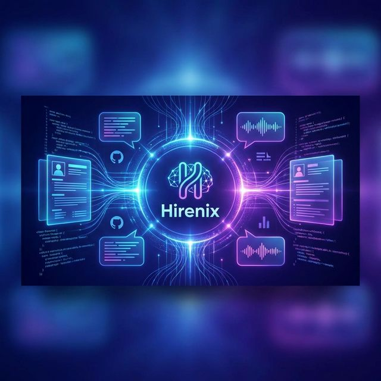
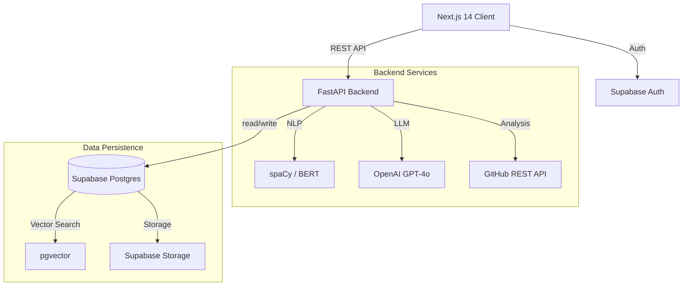

<p align="center">
  
</p>

# 🚀 Hirenix

> **Next-Gen AI Career Acceleration Platform**  
> _Optimize your resume, master interviews, and land your dream job with AI-powered insights._

[](LICENSE)
[]()
[]()

---

## 📖 Overview

**Hirenix** is a comprehensive SaaS platform designed to bridge the gap between job seekers and their dream roles. By leveraging advanced NLP, vector embeddings, and Large Language Models (LLMs), Hirenix provides deep, actionable feedback on resumes, GitHub profiles, and interview performance.

Unlike generic keyword mashers, Hirenix understands _context_—matching your actual skills and potential to the nuanced requirements of modern job descriptions.

## ✨ Key Features

### 🧠 AI Resume Intelligence
- **ATS Scoring 2.0**: Goes beyond keyword counting. Analyzes impact, context, and quantifying metrics.
- **Skill Gap Analysis**: Identifies exactly what skills you're missing for a specific role.
- **Tailored Suggestions**: rewriting suggestions to improve clarity and impact.

### 🐙 GitHub Portfolio Analyzer (GPI)
- **Code Quality Metrics**: Analyzes your actual code, not just contribution graphs.
- **Project Depth Scoring**: Evaluates architectural complexity and best practices.
- **Readme & Documentation Audit**: Ensures your projects tell a compelling story.

### 🎯 Job Matcher & Tailor
- **Semantic Matching**: Uses `pgvector` to match your resume's semantic meaning against job descriptions.
- **Custom Cover Letters**: Generates highly personalized cover letters based on the match.

### 🎙️ Mock Interview Engine
- **Context-Aware Questions**: GenAI generates questions based on *your* resume and the specific JD.
- **Real-time Feedback**: Evaluation of your answers for clarity, depth, and relevance.
- **Voice Mode**: (Coming Soon) Practice with voice interaction.

---

## 🏗️ Architecture

Hirenix is built on a modern, scalable, and type-safe stack.



## 🛠️ Tech Stack

- **Frontend**: Next.js 14 (App Router), TypeScript, Tailwind CSS, Lucide Icons, Recharts
- **Backend**: FastAPI (Python 3.11), Pydantic, Spacy, Sentence-Transformers
- **Database**: Supabase (PostgreSQL 15), pgvector extension
- **AI/ML**: OpenAI GPT-4o, En_core_web_sm, HuggingFace embeddings
- **Infrastructure**: Vercel (Frontend), Railway/Render (Backend)

---

## 🚀 Getting Started

### Prerequisites
- Node.js 18+
- Python 3.11+
- Supabase Account
- OpenAI API Key
- GitHub Token

### 1. Clone the Repository
```bash
git clone https://github.com/SudoAnirudh/Hirenix.git
cd Hirenix
```

### 2. Backend Setup
```bash
cd backend
python -m venv .venv
source .venv/bin/activate  # Windows: .venv\Scripts\activate

# Install dependencies
pip install -r requirements.txt
python -m spacy download en_core_web_sm

# Configure Environment
cp .env.example .env
# Edit .env and add your SUPABASE_URL, SUPABASE_KEY, OPENAI_API_KEY, etc.

# Run Server
uvicorn main:app --reload
```

### 3. Frontend Setup
```bash
cd frontend
npm install

# Configure Environment
cp .env.local.example .env.local
# Add NEXT_PUBLIC_SUPABASE_URL and NEXT_PUBLIC_SUPABASE_ANON_KEY

# Run Client
npm run dev
```

### 4. Database Setup
Execute the SQL commands in `supabase/schema.sql` via the Supabase SQL Editor to verify the schema and enable `pgvector`.

---

## 🤝 Contributing

Contributions are what make the open source community such an amazing place to learn, inspire, and create. Any contributions you make are **greatly appreciated**.

1. Fork the Project
2. Create your Feature Branch (`git checkout -b feature/AmazingFeature`)
3. Commit your Changes (`git commit -m 'Add some AmazingFeature'`)
4. Push to the Branch (`git push origin feature/AmazingFeature`)
5. Open a Pull Request

## 📄 License

Distributed under the MIT License. See `LICENSE` for more information.

---

<p align="center">
  Built with ❤️ by <a href="https://github.com/SudoAnirudh">SudoAnirudh</a>
</p>
