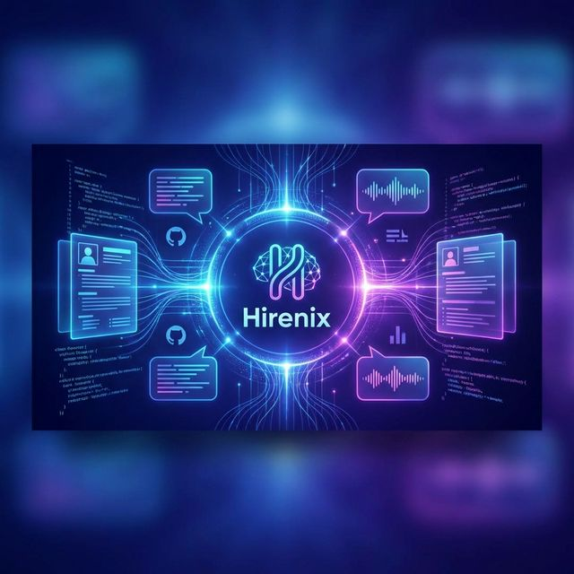
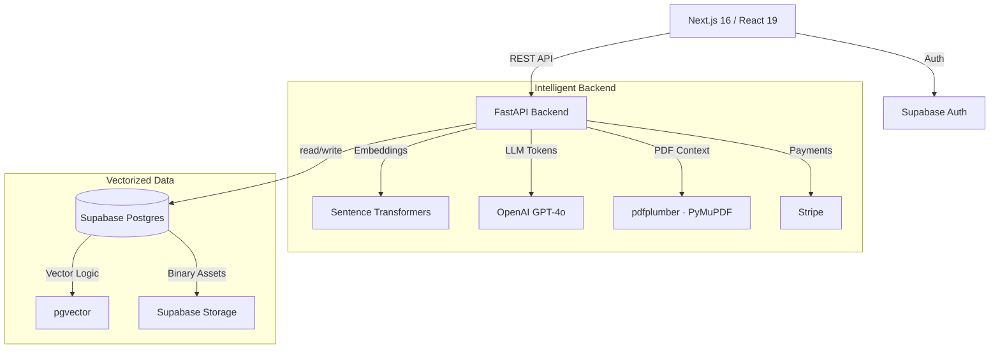

<p align="center">
  
</p>

# 🚀 Hirenix

> **The AI-Powered Career Intelligence Platform**  
> _Stop guessing, start landing. Professional resume engineering, GitHub auditing, and real-time interview prep — powered by hybrid NLP and LLMs._

<p align="center">
  
  
  
</p>

<p align="center">
  <a href="https://opensource.org/licenses/MIT"></a>
  <a href="http://makeapullrequest.com"></a>
  
</p>

---

## 🌟 Overview

**Hirenix** is not just another resume builder. It's a comprehensive **Career Intelligence SaaS** designed for the modern job market. By combining semantic search via `pgvector`, hybrid ATS scoring engines, and context-aware LLM agents, Hirenix provides the edge needed to outpace automated screening and technical interviews.

### Why Hirenix?

- **Hybrid Scoring**: Beyond keyword stuffing — we use semantic similarity to measure how well your experience _actually_ matches a role.
- **Deep Code Analysis**: We don't just count GitHub commits; we analyze code quality, architectural depth, and documentation clarity.
- **Contextual Preparation**: Interviews aren't generic. Our AI generates session-specific questions based on the intersection of your profile and the target role.

---

## ✨ Features

### 🧠 AI Resume Intelligence

- **Hybrid ATS Scoring**: 70% rule-based logic + 30% semantic meaning using `all-MiniLM-L6-v2`.
- **Quantifiable Impact Audit**: Identifies missing metrics and results-oriented language.
- **Targeted Skill Gap Analysis**: Visualizes exactly where your profile falls short for specific seniorities.

### 🐙 GitHub Portfolio Analyzer

- **Architectural Depth**: Scores projects based on complexity, best practices, and patterns.
- **Documentation Audit**: Evaluates READMEs and inline documentation for professional clarity.
- **Real-world Insight**: Distills contribution graphs into a narrative of technical growth.

### 🎯 Job Matcher & Tailor

- **Vector Search Matching**: Leverages `pgvector` for deep semantic alignment between resumes and JDs.
- **Smart Tailoring**: Generates personalized cover letters and summaries that highlight the most relevant 20% of your experience.

### 🎙️ Mock Interview Engine

- **Session-Specific Prep**: Generates questions that probe the specific gaps between your resume and a job.
- **Performance Feedback**: Scored on clarity, technical depth, and behavioral alignment.
- **Premium Glassmorphism UI**: A focused, high-stakes environment for maximum prep quality.

---

## 🏗️ Architecture


```mermaid
graph TD
    Client[Next.js 16 / React 19] -->|REST API| API[FastAPI Backend]
    Client -->|Auth| SupabaseAuth[Supabase Auth]

    subgraph "Intelligent Backend"
        API -->|Embeddings| ST[Sentence Transformers]
        API -->|LLM Tokens| OpenAI[OpenAI GPT-4o]
        API -->|PDF Context| PDF[pdfplumber · PyMuPDF]
        API -->|Payments| Stripe[Stripe]
    end

    subgraph "Vectorized Data"
        API -->|read/write| DB[(Supabase Postgres)]
        DB -->|Vector Logic| PgVector[pgvector]
        DB -->|Binary Assets| S3[Supabase Storage]
    end
```

---

## 🛠️ Tech Stack

| Component      | Technology                         | Version              |
| -------------- | ---------------------------------- | -------------------- |
| **Core UI**    | Next.js, React, TypeScript         | 16.1.6 / 19.2.3      |
| **Styling**    | Tailwind CSS v4, Framer Motion     | 4.0.0+               |
| **API Server** | FastAPI, Python, Pydantic v2       | 0.115.0 / 3.11+      |
| **Database**   | PostgreSQL, pgvector               | Managed via Supabase |
| **AI/ML**      | sentence-transformers, NLP, OpenAI | 2.7.0 / GPT-4o       |
| **Parsing**    | pdfplumber, PyMuPDF                | 0.11 / 1.24          |
| **Payments**   | Stripe                             | 8.3.0                |

---

## 🚀 Getting Started

### 1. Unified Setup (Recommended)

The project uses `concurrently` to manage both environments from the root.

```bash
git clone https://github.com/SudoAnirudh/Hirenix.git
cd Hirenix

# Initialize Backend
cd backend && python -m venv venv
source venv/bin/activate # or venv\Scripts\activate
pip install -r requirements.txt
cp .env.example .env # Fill with keys

# Initialize Frontend
cd ../frontend && npm install
cp .env.local.example .env.local # Fill with keys

# Start Shared Dev Server (from root)
cd .. && npm run dev
```

### 2. Environment Variables

Ensure the following are configured:

- **Backend**: `SUPABASE_URL`, `SUPABASE_KEY`, `JWT_SECRET`, `OPENAI_API_KEY`, `GITHUB_TOKEN`, `STRIPE_SECRET_KEY`
- **Frontend**: `NEXT_PUBLIC_SUPABASE_URL`, `NEXT_PUBLIC_SUPABASE_ANON_KEY`, `NEXT_PUBLIC_API_URL`

---

## 📂 Project Structure

```text
hirenix/
├── assets/             # Global visual assets
├── backend/            # FastAPI application
│   ├── models/         # Pydantic schemas
│   ├── routers/        # Feature controllers (auth, resume, github, etc.)
│   ├── services/       # Core business logic (ATS, matching, interview)
│   └── utils/          # Weights, cleaners, and constants
├── frontend/           # Next.js App Router project
│   ├── app/            # Feature pages & layouts
│   ├── components/     # UI primitives & design system
│   └── lib/            # API clients & auth wrappers
└── supabase/           # SQL schema & migrations
```

---

## 🌍 Community

Contributions drive Hirenix forward! Please see:

- [Contributing](CONTRIBUTING.md)
- [Code of Conduct](CODE_OF_CONDUCT.md)
- [Security](SECURITY.md)

---

## ✨ Contributors

<!-- ALL-CONTRIBUTORS-LIST:START - Do not remove or modify this section -->
<!-- prettier-ignore-start -->
<!-- markdownlint-disable -->
<table>
  <tbody>
    <tr>
      <td align="center" valign="top" width="14.28%"><a href="https://portfolio-blue-five-10.vercel.app/"><br /><sub><b>Anirudh S</b></sub></a><br /><a href="https://github.com/SudoAnirudh/Hirenix/commits?author=SudoAnirudh" title="Code">💻</a> <a href="https://github.com/SudoAnirudh/Hirenix/commits?author=SudoAnirudh" title="Documentation">📖</a> <a href="#design-SudoAnirudh" title="Design">🎨</a> <a href="#infra-SudoAnirudh" title="Infrastructure (Hosting, Build-Tools, etc)">🚇</a></td>
    </tr>
  </tbody>
</table>

<!-- markdownlint-restore -->
<!-- prettier-ignore-end -->

<!-- ALL-CONTRIBUTORS-LIST:END -->

This project follows the [all-contributors](https://github.com/all-contributors/all-contributors) specification. Contributions of any kind welcome!

## 📄 License

Distributed under the MIT License. See [LICENSE](LICENSE) for more information.

<p align="center">
  Built with ❤️ by <a href="https://github.com/SudoAnirudh">SudoAnirudh</a> & Contributors.
</p>
