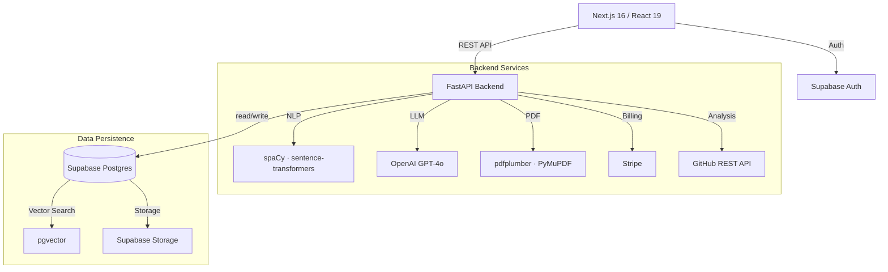

<p align="center">
  
</p>

# 🚀 Hirenix

> **AI-Powered Career Acceleration Platform**  
> _Analyze your resume, audit your GitHub, prep for interviews — all in one place._

[](https://opensource.org/licenses/MIT)
[](http://makeapullrequest.com)
[](https://github.com/SudoAnirudh/Hirenix)

---

## 📖 Overview

**Hirenix** is an open-source SaaS platform that helps job seekers land their dream roles faster. It combines NLP, vector embeddings, and LLMs to deliver deep, actionable feedback on your resume, GitHub profile, and interview performance — far beyond simple keyword matching.

## ✨ Features

### 🧠 AI Resume Intelligence
- **ATS Scoring**: Analyses impact, context, and quantifiable metrics — not just keywords
- **Skill Gap Analysis**: Pinpoints exactly what's missing for a specific role
- **Rewrite Suggestions**: Targeted rewrites to sharpen clarity and impact

### 🐙 GitHub Portfolio Analyzer
- **Code Quality Metrics**: Reviews actual code, not just contribution graphs
- **Project Depth Scoring**: Evaluates architecture and best practices
- **README Audit**: Ensures your projects tell a compelling story

### 🎯 Job Matcher & Tailor
- **Semantic Matching**: Uses `pgvector` to match resume meaning against job descriptions
- **Custom Cover Letters**: Generates personalized cover letters based on the match

### 🎙️ Mock Interview Engine
- **Context-Aware Questions**: Questions generated from your own resume and target JD
- **Real-time Feedback**: Scored on clarity, depth, and relevance
- **Voice Mode**: _(Coming Soon)_

---

## 🏗️ Architecture


```mermaid
graph TD
    Client[Next.js 16 / React 19] -->|REST API| API[FastAPI Backend]
    Client -->|Auth| SupabaseAuth[Supabase Auth]

    subgraph "Backend Services"
        API -->|NLP| Spacy[spaCy · sentence-transformers]
        API -->|LLM| OpenAI[OpenAI GPT-4o]
        API -->|PDF| PDF[pdfplumber · PyMuPDF]
        API -->|Billing| Stripe[Stripe]
        API -->|Analysis| GitHubAPI[GitHub REST API]
    end

    subgraph "Data Persistence"
        API -->|read/write| DB[(Supabase Postgres)]
        DB -->|Vector Search| PgVector[pgvector]
        DB -->|Storage| S3[Supabase Storage]
    end
```

## 🛠️ Tech Stack

| Layer | Technologies |
|---|---|
| **Frontend** | Next.js 16, React 19, TypeScript, Tailwind CSS v4, Framer Motion, Tiptap, Recharts, Lucide Icons |
| **Backend** | FastAPI, Python 3.11, Pydantic v2, Uvicorn |
| **AI / NLP** | OpenAI GPT-4o, spaCy, sentence-transformers |
| **PDF** | pdfplumber, PyMuPDF |
| **Database** | Supabase (PostgreSQL + pgvector), Supabase Storage |
| **Payments** | Stripe |
| **Infra** | Vercel (frontend), Render (backend) |
| **Tooling** | Husky, lint-staged, Prettier, ESLint, concurrently |

---

## 🚀 Getting Started

### Prerequisites
- Node.js 18+
- Python 3.11
- Supabase project
- OpenAI API key
- GitHub personal access token

### 1. Clone the repository
```bash
git clone https://github.com/SudoAnirudh/Hirenix.git
cd Hirenix
```

### 2. Backend setup
```bash
cd backend
python -m venv venv
source venv/bin/activate      # Windows: venv\Scripts\activate

pip install -r requirements.txt
python -m spacy download en_core_web_sm

cp .env.example .env
# Fill in SUPABASE_URL, SUPABASE_KEY, OPENAI_API_KEY, GITHUB_TOKEN, STRIPE_SECRET_KEY

uvicorn main:app --reload
```

### 3. Frontend setup
```bash
cd frontend
npm install

cp .env.local.example .env.local
# Fill in NEXT_PUBLIC_SUPABASE_URL, NEXT_PUBLIC_SUPABASE_ANON_KEY, NEXT_PUBLIC_API_URL

npm run dev
```

### 4. Run both together (from root)
```bash
npm run dev
```

### 5. Database setup
Run the SQL in `supabase/schema.sql` via the Supabase SQL Editor to create the schema and enable `pgvector`.

---

## 🌍 Contributing

Contributions are greatly appreciated! Please review the community docs first:

- [Contributing Guidelines](CONTRIBUTING.md)
- [Code of Conduct](CODE_OF_CONDUCT.md)
- [Security Policy](SECURITY.md)

**Quick steps:**
1. Fork the repo
2. Create a feature branch: `git checkout -b feature/my-feature`
3. Commit: `git commit -m 'feat: add my feature'`
4. Push: `git push origin feature/my-feature`
5. Open a Pull Request

## ✨ Contributors

<!-- ALL-CONTRIBUTORS-LIST:START - Do not remove or modify this section -->
<!-- prettier-ignore-start -->
<!-- markdownlint-disable -->
<table>
  <tbody>
    <tr>
      <td align="center" valign="top" width="14.28%"><a href="https://portfolio-blue-five-10.vercel.app/"><br /><sub><b>Anirudh S</b></sub></a><br /><a href="https://github.com/SudoAnirudh/Hirenix/commits?author=SudoAnirudh" title="Code">💻</a> <a href="https://github.com/SudoAnirudh/Hirenix/commits?author=SudoAnirudh" title="Documentation">📖</a> <a href="#design-SudoAnirudh" title="Design">🎨</a> <a href="#infra-SudoAnirudh" title="Infrastructure (Hosting, Build-Tools, etc)">🚇</a></td>
    </tr>
  </tbody>
</table>

<!-- markdownlint-restore -->
<!-- prettier-ignore-end -->

<!-- ALL-CONTRIBUTORS-LIST:END -->

This project follows the [all-contributors](https://github.com/all-contributors/all-contributors) specification. Contributions of any kind welcome!

## 📄 License

Distributed under the MIT License. See [LICENSE](LICENSE) for more information.

---

<p align="center">
  Built with ❤️ by <a href="https://github.com/SudoAnirudh">SudoAnirudh</a> and open source contributors.
</p>
